```mermaid
flowchart TD

    START([🚀 Start Snipe-IT Deployment]) --> ASSERT_START[🔍 Validate Variables]
    
    %% Assertion Phase
    ASSERT_START --> |"✅ Pass"| ASSERT_PASS[🎉 Variables Valid]
    ASSERT_START --> |"❌ Fail"| ASSERT_FAIL[💥 Abort Execution]
    
    %% Installation Phase
    ASSERT_PASS --> INIT_PACKAGES[📦 Install System Packages]
    INIT_PACKAGES --> USER_SETUP
    
    %% User Setup Phase
    USER_SETUP[👤 Create Snipe-IT User/Group] --> DATA_DIR[📁 Create Data Directory]
    DATA_DIR --> APP_KEY
    
    %% App Key Generation
    APP_KEY[🔑 Generate APP_KEY] --> DB_SETUP
    
    %% Database Setup Phase
    DB_SETUP[🗄️ Configure MySQL Database] --> DB_USERS[👤 Set Database Users]
    DB_USERS --> CONTAINER_DEPLOY
    
    %% Container Deployment Phase
    CONTAINER_DEPLOY[🐳 Deploy Snipe-IT Container] --> NETWORK_SETUP[🌐 Configure Docker Network]
    NETWORK_SETUP --> MOUNT_SETUP[📂 Setup Bind Mounts]
    MOUNT_SETUP --> ENV_CONFIG[⚙️ Configure Environment Variables]
    ENV_CONFIG --> PORT_MAPPING[🔌 Map Ports]
    PORT_MAPPING --> START_CONTAINER[🚀 Start Container]
    
    %% Completion
    START_CONTAINER --> COMPLETE([🎊 Deployment Complete! 🎊])
    
    %% Styling
    classDef assertPhase fill:#ffebee,stroke:#d32f2f,stroke-width:2px,color:#000
    classDef initPhase fill:#e8f5e8,stroke:#4caf50,stroke-width:2px,color:#000
    classDef userPhase fill:#e3f2fd,stroke:#2196f3,stroke-width:2px,color:#000
    classDef dbPhase fill:#f3e5f5,stroke:#9c27b0,stroke-width:2px,color:#000
    classDef containerPhase fill:#fff3e0,stroke:#ff9800,stroke-width:2px,color:#000
    classDef startEnd fill:#e1f5fe,stroke:#01579b,stroke-width:3px,color:#000
    classDef error fill:#ffebee,stroke:#c62828,stroke-width:2px,color:#000
    
    class ASSERT_START,ASSERT_PASS assertPhase
    class ASSERT_FAIL error
    class INIT_PACKAGES initPhase
    class USER_SETUP,DATA_DIR userPhase
    class APP_KEY,DB_SETUP,DB_USERS dbPhase
    class CONTAINER_DEPLOY,NETWORK_SETUP,MOUNT_SETUP,ENV_CONFIG,PORT_MAPPING,START_CONTAINER containerPhase
    class START,COMPLETE startEnd
```

Snipe-IT Deployment Ansible Role

📑 Table of Contents

🔄 Deployment Flow

🚀 Features

📋 Requirements

Ansible Version

Collections
Target Host Requirements
Network Requirements

🛠 Installation
Install Required Collections
Install the Role

📖 Usage
Basic Playbook Example
Inventory Configuration

🔧 Variables
Required Variables
Optional Variables

🔄 Deployment Architecture
🛡️ Security Best Practices
User Permissions
Database Security

👥 Contributing

Overview
This Ansible role, snipeit, automates the deployment and configuration of Snipe-IT, an open-source asset management system, using Docker containers. It supports:

Docker-based deployment of Snipe-IT server
MySQL database setup and integration
Automated user and group management for secure file permissions
Application key generation for secure Snipe-IT configuration
Flexible networking with Docker networks
Data persistence through bind mounts
Configurable environment variables for customization

🔄 Deployment Flow

🚀 Features

Automated Deployment: Deploys Snipe-IT in a Docker container with minimal manual intervention
Database Integration: Configures MySQL database with proper encoding and user permissions
Secure User Management: Creates dedicated system user and group for Snipe-IT
Persistent Storage: Uses bind mounts for data persistence
Customizable Configuration: Supports environment variable customization for flexibility
Network Flexibility: Configures Docker networking for secure communication
Secure Application Key: Generates a unique APP_KEY for Snipe-IT
Idempotent Operations: Ensures consistent deployments with Ansible's idempotency

📋 Requirements
Ansible Version

Ansible 2.15+

Collections
collections:
  - community.docker
  - ansible.builtin

Target Host Requirements

Docker installed and running
Required packages: docker.io, php8.1, python, docker-compose
Python Docker library (python3-docker)

Network Requirements

Docker network (database_net) for container communication
Port access for Snipe-IT (default: 8080)
MySQL port access (default: 3306)

🛠 Installation
Install Required Collections
ansible-galaxy collection install community.docker
ansible-galaxy collection install ansible.builtin

Install the Role
# Via Git
git clone https://codebase.vaslapp.com/devops/vasl/ansible/roles/snipeit.git roles/snipeit

# Or download and extract to your roles directory

📖 Usage
Basic Playbook Example
---
- name: Deploy Snipe-IT
  hosts: snipeit_servers
  gather_facts: true
  become: true
  tasks:
    - name: Include Snipe-IT Role
      ansible.builtin.include_role:
        name: snipeit
      vars:
        snipeit_server_container_name: "snipeit-server"
        snipeit_host_port: 8080
        snipeit_db_name: "snipeit_db"
        snipeit_db_user: "snipeit_user"
        snipeit_db_password: "secure_password"
        mysql_host: "mysql"
        mysql_port: 3306

Inventory Configuration
---
snipeit_servers:
  hosts:
    host-1:
      ansible_host: 192.168.1.100
      ansible_user: ansible
      ansible_ssh_private_key_file: secrets/ssh/ansible_ssh_priv_key

🔧 Variables
Required Variables

Variable
Description
Example

snipeit_server_container_image
Docker image for Snipe-IT
"artifacts.vaslapp.com/share/vasl/snipeit"

snipeit_server_container_name
Name of the Snipe-IT container
"snipeit-server"

snipeit_server_container_base_dir
Base directory for container data
"/mnt/containers"

_snipeit_server_user
System user for Snipe-IT
"snipeit"

_snipeit_server_group
System group for Snipe-IT
"snipeit"

snipeit_app_key
Application key for Snipe-IT
"base64:LySUxE/6QbccxeXFDfcV5MYDgzLcxDPQSOMp3xisRjY="

snipeit_host_port
Host port for Snipe-IT
8080

mysql_host
MySQL container name or host
"mysql"

mysql_port
MySQL port
3306

snipeit_db_name
Snipe-IT database name
"snipeit_db"

snipeit_db_user
Database user for Snipe-IT
"snipeit_user"

snipeit_db_password
Database password
"secure_password"

Optional Variables

Variable
Description
Default
When Required

snipeit_server_container_image_tag
Docker image tag
"v8.2.1"
Optional for specific versions

snipeit_server_container_recreate
Force container recreation
false
When updating container

snipeit_db_encoding
Database encoding
"utf8mb4"
Optional for custom encoding

snipeit_db_collation
Database collation
"utf8mb4_unicode_ci"
Optional for custom collation

🔄 Deployment Architecture

Architecture Notes:

The Snipe-IT container communicates with MySQL over a dedicated Docker network (database_net)
Data persistence is ensured via bind mounts to the host filesystem
The Ansible controller manages both the Snipe-IT and MySQL deployments

🛡️ Security Best Practices
User Permissions
# Recommended configuration
_snipeit_server_user: "snipeit"
_snipeit_server_group: "snipeit"
snipeit_server_container_base_dir: "/mnt/containers"

Security Notes:

Use a dedicated system user (snipeit) with minimal permissions
Set proper ownership and permissions (0755) on data directories
Restrict SSH access to the Ansible controller with secure keys

Database Security
# Recommended configuration
snipeit_db_password: "{{ vault_snipeit_db_password }}"
mysql_admin_password: "{{ vault_mysql_admin_password }}"

Security Notes:

Store sensitive credentials (e.g., snipeit_db_password, mysql_admin_password) in Ansible Vault
Limit database user privileges to the Snipe-IT database only
Use strong, unique passwords for database access

👥 Contributing
Author: S.Mohebtash - s.mohebtash@vasl.ir
